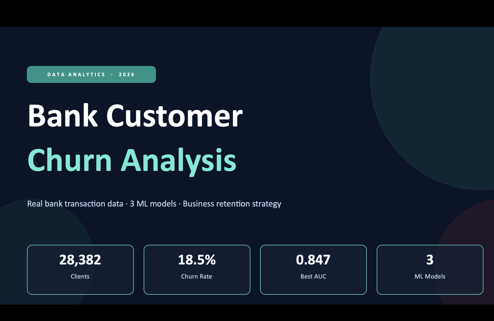
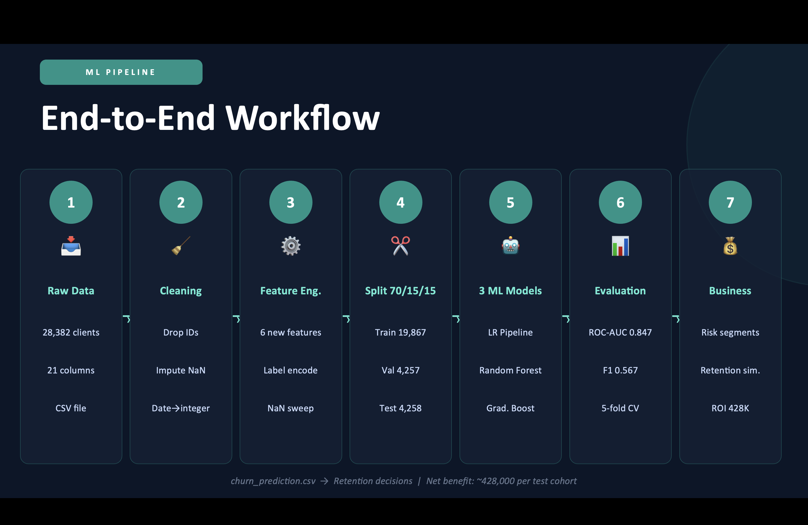

# Bank Customer Churn Analysis
Machine learning project analyzing bank customer churn and identifying customers at risk of leaving.

## Project Overview

This project analyzes a dataset of 28,382 bank customers to predict churn and support customer retention strategies.

Models used:
- Logistic Regression
- Random Forest
- Gradient Boosting

Best performance:
ROC-AUC: 0.847

## Workflow

1. Data cleaning
2. Feature engineering
3. Train/test split (70/15/15)
4. Model training
5. Model evaluation
6. Business interpretation

## Tools

Python  
Pandas  
Scikit-learn  
Jupyter Notebook

## Business Insight

The model helps identify high-risk customer segments and can support targeted retention strategies for banks.
